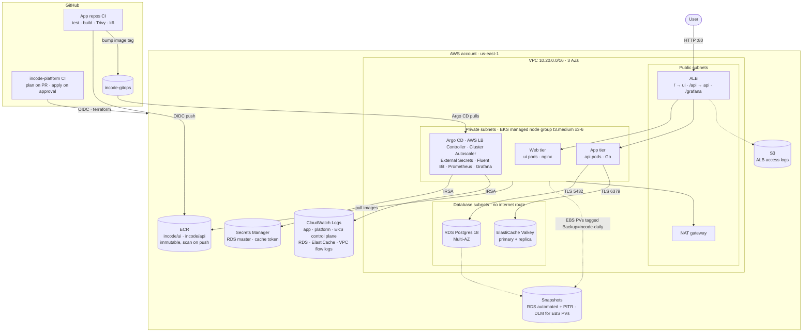
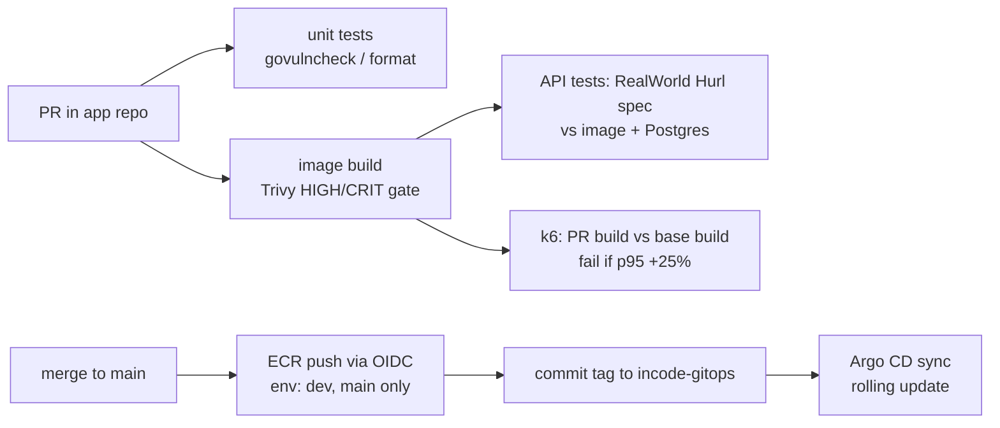

# incode-platform

Infrastructure for running the [RealWorld](https://github.com/gothinkster/realworld) app (Angular UI and Go/Gin API) on AWS. It uses EKS, RDS, ElastiCache, GitOps with Argo CD, and GitHub Actions CI/CD.

| Repo | Role |
|---|---|
| **incode-platform** (this repo) | Terraform for every AWS resource, the Argo CD bootstrap, and the infra pipeline |
| [incode-gitops](https://github.com/dwanbryant-devops/incode-gitops) | Desired state of the cluster (add-ons and the app), synced by Argo CD |
| [golang-gin-realworld-example-app](https://github.com/dwanbryant-devops/golang-gin-realworld-example-app) | API source, Dockerfile, CI (tests, image, API tests, performance regression, deploy) |
| [angular-realworld-example-app](https://github.com/dwanbryant-devops/angular-realworld-example-app) | UI source, Dockerfile, CI (tests, e2e, image, deploy) |

## Architecture



### Tiers

| Tier | Runs on | Isolation |
|---|---|---|
| Edge | ALB in public subnets, managed by the AWS Load Balancer Controller | Only ports 80 (and 443 once there's a domain) open to the internet. Targets are pod IPs. |
| Web | `ui` pods (unprivileged nginx serving the Angular build) | NetworkPolicy: ingress only from inside the VPC (the ALB), no egress except DNS |
| App | `api` pods (Go, distroless) | NetworkPolicy: ingress from the ALB and Prometheus; egress only to Postgres/Valkey ports |
| Cache | ElastiCache Valkey: primary plus replica, automatic failover, TLS and auth token | Database subnets; its security group accepts only the EKS node SG on 6379 |
| Data | RDS Postgres 18, Multi-AZ, TLS enforced (`rds.force_ssl`) | Database subnets with **no route to the internet**; its SG accepts only the EKS node SG on 5432 |

## Repository layout

```
bootstrap/            one-time, applied by a human: state bucket, GitHub OIDC, CI roles
global/ecr/           account-wide ECR repositories (images are promoted across envs, not rebuilt)
modules/              opinionated wrappers around terraform-aws-modules
  network/            VPC, 3-tier subnets, NAT, flow logs, VPC endpoints
  eks/                cluster, access entries, add-ons, managed node group, EBS CSI IRSA
  data/               RDS Postgres, ElastiCache Valkey, their security groups and secrets
  backup/             DLM snapshot policy for EBS PVs, backup-failure alerts (AWS Backup is SCP-blocked)
  platform/           IRSA roles for add-ons, log groups, ALB log bucket, Argo CD bootstrap
envs/dev/             one thin root module per layer; this folder IS dev's configuration
  10-network/  20-eks/  30-data/  40-platform/
```

**Why layers with separate state?** Each layer has its own state file and blast radius, so a bad change to the platform add-ons can't touch the VPC or the database. Plans stay fast, and layers change at different rates. Downstream layers read upstream outputs through `terraform_remote_state`.

**Scaling beyond one environment:** copy `envs/dev` to `envs/prod` and change the values in each `main.tf`: CIDR, NAT per AZ, interface endpoints, node sizes, deletion protection. Then add `prod` to `apply_environments` in `bootstrap/`. State keys are namespaced per environment. The gitops repo needs only `values/prod/realworld.yaml`, because its ApplicationSets generate an Application for every registered cluster. For stronger isolation, the next step is one AWS account per environment, with the same layers and a provider `assume_role` per account.

## Setup from scratch

Prerequisites: Terraform ≥ 1.10, AWS CLI v2, kubectl, and an admin IAM role that requires MFA (see [bootstrap/README.md](bootstrap/README.md)).

```sh
# 0. Credentials. Terraform can't prompt for MFA, so let the CLI do it and export the session:
aws sts get-caller-identity --profile incode-admin
eval "$(aws configure export-credentials --profile incode-admin --format env)"

# 1. One-time bootstrap: state bucket, OIDC, CI roles. See bootstrap/README.md.
cd bootstrap && terraform init && terraform apply && cd ..
#    Then set the backend bucket in envs/dev/backend.hcl and global/backend.hcl.

# 2. Layers, in order (the CI pipeline does exactly this after approval)
for s in global/ecr envs/dev/10-network envs/dev/20-eks envs/dev/30-data envs/dev/40-platform; do
  terraform -chdir=$s init -backend-config=../backend.hcl && terraform -chdir=$s apply
done

# 3. Access the cluster
aws eks update-kubeconfig --name incode-dev --region us-east-1
kubectl -n argocd get applications      # add-ons and app syncing from incode-gitops
```

After step 2, Argo CD installs every add-on on its own. The app goes live once the app repos' CI has pushed an image and bumped its tag in incode-gitops. Rebuilding from zero takes about 40 minutes, most of it EKS and Multi-AZ RDS.

**Tear down** (about $11/day while running): destroy in reverse order, 40 → 30 → 20 → 10 → global. Before destroying 20-eks, delete the `realworld` and `monitoring` namespaces so the ALB and EBS volumes are removed.

## CI/CD



- **App pipelines** ([API](https://github.com/dwanbryant-devops/golang-gin-realworld-example-app/blob/main/.github/workflows/ci.yml), [UI](https://github.com/dwanbryant-devops/angular-realworld-example-app/blob/main/.github/workflows/ci.yml)):
  - Test, build **one** image, and scan it.
  - The API image is integration-tested with the official RealWorld API spec (Hurl, 174 requests, pinned commit) against a real Postgres.
  - On `main`, the same image is pushed to ECR with an immutable `<git-sha>` tag, and the tag is committed to incode-gitops.
- **Performance regression detection** (bonus): on each API PR, CI builds the base branch and the PR branch, load-tests each with k6 against a fresh Postgres on the same runner, and fails if any endpoint's p95 regresses more than 25% (and more than 5 ms). Comparing both builds on one runner cancels out runner-speed noise, which makes the check reliable enough to block merges.
- **Infra pipeline** ([.github/workflows/terraform.yml](.github/workflows/terraform.yml)):
  - PRs run `fmt`, `validate`, `tflint` and `checkov`, then a `plan` of every stack with the read-only role, shown in the run summary.
  - A merge to `main` waits for approval in the `dev` environment, then applies the stacks in order.
- **Credentials:** no long-lived AWS keys anywhere. GitHub OIDC tokens are exchanged for per-job roles, and the trust policies pin the repo and the environment (see [bootstrap/](bootstrap/)).

## Security

- **Identity**
  - Humans use an IAM user whose keys can only assume an `admin` role that requires MFA.
  - CI uses OIDC roles scoped per repo and environment:
    - `gha-tf-plan` is read-only.
    - `gha-tf-apply` is admin, but it can't edit its own role, the OIDC provider or the state bucket, and can't create IAM users.
    - The ECR push roles can each write to one repository.
- **Cluster access:** EKS access entries only (no `aws-auth` ConfigMap), with no implicit admin for whoever created the cluster.
- **Pod credentials**
  - IRSA: each add-on gets its own role, trusted only by its own service account.
  - Nodes enforce IMDSv2 with hop limit 1, so pods **can't** borrow the node's role.
  - App pods mount no service-account token.
- **Network**
  - The data tier has no internet route. Security groups admit only the EKS node SG.
  - Default-deny NetworkPolicies in the app namespace. The ALB is the only internet-facing entry point, and Argo CD isn't exposed (port-forward only).
- **Secrets**
  - RDS generates and stores its own master password (`manage_master_user_password`).
  - External Secrets syncs secrets into Kubernetes. Its ClusterSecretStore is limited to the `realworld` namespace, and its IAM role can read only the two secret ARNs it needs.
  - The JWT key is generated in the cluster.
  - Kubernetes Secrets are envelope-encrypted with KMS.
- **Workloads:** Pod Security `restricted` is enforced on the app namespace. Containers are non-root with read-only root filesystems and all capabilities dropped. The API image is distroless.
- **Encryption at rest:** RDS, ElastiCache, EBS (so snapshots too), the ECR repos and S3 state (KMS). **In transit:** Postgres and Valkey require TLS.
- **Supply chain:** ECR tags are immutable. Images are scanned by Trivy in CI and again by ECR on push.

## Observability (the 3am story)

| Signal | Where |
|---|---|
| **App metrics** | Prometheus scrapes the API's `/metrics`: requests and latency histograms per route, and `go_sql_*` connection-pool stats. Also `realworld_cache_requests_total` for the cache hit ratio. |
| **Cluster metrics** | kube-prometheus-stack: node-exporter, kube-state-metrics, cAdvisor. 15 days of history on a gp3 volume that's backed up daily. |
| **AWS metrics** | Grafana's CloudWatch data source, via IRSA. Pre-loaded dashboards for RDS, ALB and ElastiCache. |
| **Logs** | Fluent Bit sends container logs to `/incode/dev/app` (app namespace) and `/incode/dev/platform` (everything else, plus kubelet).<br>Also in CloudWatch: EKS control-plane logs, RDS Postgres logs (slow queries over 500 ms, connections), the ElastiCache slow log, and VPC flow logs.<br>ALB access logs go to S3. |
| **Dashboards** | Grafana at `http://<alb>/grafana`. The "RealWorld API" dashboard shows RPS, 5xx ratio, p50/p95/p99, **p95 by route**, DB pool, HPA replicas and cache hit ratio. |
| **Alerts** | PrometheusRules for API 5xx above 5% and p95 above 500 ms; snapshot and RDS backup failures go to SNS. |

**Debugging slow requests at 3am:**
1. On the RealWorld dashboard, find the route whose p95 moved in "p95 by route".
2. Check whether the DB pool shows waits (the database is the bottleneck) or whether CPU is at the HPA limit (the app is).
3. If it's the database: open RDS Performance Insights, or the Grafana RDS dashboard, to find the query. Postgres logs every query slower than 500 ms.
4. Look up the matching app logs in CloudWatch Logs Insights (`/incode/dev/app`).
5. Correlate with the ALB 5xx and latency panels to see the user impact.

## Backups

| Data | Mechanism | Retention |
|---|---|---|
| RDS Postgres | Automated daily snapshots (03:00 UTC window) plus point-in-time recovery to any second (5-minute RPO) | 7 days |
| Every Kubernetes PV (Prometheus, Grafana, Alertmanager) | EBS Data Lifecycle Manager: daily at 05:00 UTC and weekly on Sunday. It selects volumes tagged `Backup=incode-daily`, which the default gp3 StorageClass sets on every volume it creates. | 14 daily and 5 weekly snapshots |
| Valkey | Daily snapshot (the cache can be rebuilt from Postgres anyway) | 1 day |
| Terraform state | S3 versioning | 90 days of old versions |

DLM policy errors (via EventBridge) and RDS backup, failure and recovery events publish to an SNS topic.

**Why not AWS Backup?** It was the first design: one vault, one plan, tag-based selection. This account's organization SCP explicitly denies every `backup:*` action, though, so the design uses each service's native mechanism instead. With AWS Backup available, I'd add it for a separate vault with Vault Lock and cross-account/cross-region copies. That protects against account compromise, which native snapshots in the same account don't.

## Cost-driven choices for dev (and what prod would change)

| Choice in dev | Why | Prod |
|---|---|---|
| One NAT gateway | Saves about $65/month; the trade-off is that losing its AZ cuts egress for all AZs | `single_nat_gateway = false` (one per AZ) |
| No interface VPC endpoints (only the free S3 gateway endpoint) | About $110/month for 5 endpoints × 3 AZs | `enable_interface_endpoints = true`: ECR, STS, Logs and Secrets Manager traffic stays private |
| t3.medium nodes | The **account's SCP allows only t2/t3/t3a up to medium** | Larger or mixed instance types, or Karpenter |
| `deletion_protection = false` on RDS; recovery points deletable | So the environment can be torn down quickly | `true` everywhere |
| Argo CD non-HA; single Prometheus replica | Fits 3 small nodes | HA Argo CD, Thanos or Amazon Managed Prometheus |

## Known gaps and what I'd do next

- **No TLS at the edge.** There's no domain, so the ALB serves HTTP only. With a Route 53 zone, add ACM + ExternalDNS, an HTTPS listener and an HTTP→HTTPS redirect. The chart takes this as a small values change.
- **The public EKS API endpoint is open to `0.0.0.0/0`.** Authentication is still IAM plus access entries, but GitHub-hosted runners have no fixed IP. The fix is self-hosted runners in the VPC (for example ARC on EKS) and making the endpoint private-only.
- **`gha-tf-apply` has AdministratorAccess**, guarded by an approval gate and explicit denies. Least privilege would mean per-layer apply roles with scoped policies, plus a permissions boundary on every role Terraform creates.
- **The app uses the RDS master user.** It should get its own least-privilege Postgres role, created by a migration job or the `postgresql` Terraform provider. RDS master-password rotation is off because pods read the secret at startup; enabling it needs Reloader, or `rotation` combined with a dual-user strategy.
- **The cache auth token lives in Terraform state.** The state is encrypted with restricted access, but ElastiCache has no managed-password option. The fix is IAM authentication for Valkey.
- **Schema migrations run in-app** (GORM AutoMigrate on startup). That's fine at this scale; I'd move to versioned migrations run as an Argo CD PreSync Job.
- **No WAF or rate limiting** on the ALB. I'd add AWS WAF with managed rule groups.
- **Alertmanager has no receiver configured.** Alerts fire, but don't page anyone yet. I'd wire it to Slack or PagerDuty, and add CloudWatch alarms for RDS CPU, storage and connections.
- **No distributed tracing.** The next step is OpenTelemetry to Tempo or X-Ray, then linking traces from Grafana.
- **Deploys are plain rolling updates.** Argo Rollouts with an analysis step on the same p95 and 5xx queries would give automated canary rollback.
- **GitHub Actions are pinned to major versions.** For supply-chain hardening, pin third-party actions to commit SHAs and sign images (cosign) with admission verification.
- **CI → gitops writes use a repo deploy key.** A GitHub App token would be auditable and short-lived.
- **Terraform:** checkov is non-blocking (findings are reported), and there's no drift detection schedule. I'd add a nightly `plan -detailed-exitcode` job.
